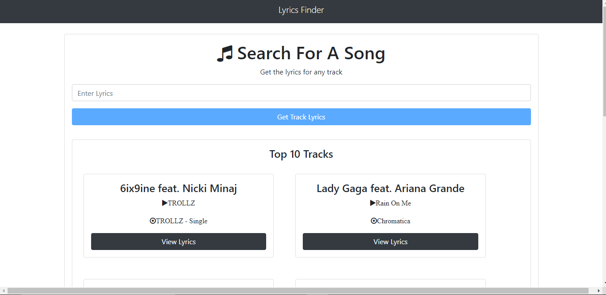

# Lyrics Finder App

## Overview

The **Lyrics Finder** app helps users find lyrics for any song by searching by song title or artist. It uses **Babel** to transpile modern JavaScript into a version compatible with older browsers. The app fetches lyrics from a public API and displays them neatly, offering a smooth user experience.

## Features

- **Search for Lyrics**: Users can search for lyrics by song title or artist name.
- **Babel Integration**: The app uses Babel to transpile ES6+ code for backward compatibility.
- **API Integration**: Fetches real-time song lyrics using a public lyrics API.
- **User-Friendly Interface**: Simple and responsive design with a search bar to find lyrics quickly.
- **Mobile Responsive**: The app works on both desktop and mobile devices, providing seamless experience across platforms.

## Project Steps

1. **Babel Setup**: Configured Babel to enable the use of modern JavaScript features, ensuring compatibility with various browsers.
2. **Design and Layout**: Designed a minimalistic UI using HTML and CSS for a clean and functional experience.
3. **API Integration**: Integrated the lyrics API to allow users to search for and view song lyrics.
4. **Search and Display**: Implemented real-time search functionality, ensuring users see lyrics instantly after submitting the search query.

## Challenges

One of the challenges was managing asynchronous requests to fetch the song lyrics and ensuring that the UI updated promptly with no delay. Handling edge cases where lyrics were unavailable for certain songs or where the search query returned no results was also a key hurdle to overcome.

## Demo

You can try the **Lyrics Finder** app live by visiting: [Lyrics Finder App](https://yg-yash.github.io/lyrics-finder/)

## GitHub Repository

The source code for this project is available on GitHub:

- [Lyrics Finder GitHub Repository](https://yg-yash.github.io/lyrics-finder/)

## Technologies Used

- **Babel**: For transpiling modern JavaScript into backward-compatible code.
- **JavaScript (ES6+)**: For creating the functionality and logic of the app.
- **HTML5 & CSS3**: For structuring and styling the app's layout.
- **API Integration**: Fetching song lyrics using a public API.

## Conclusion

The **Lyrics Finder** app demonstrates my ability to work with modern JavaScript features and integrate third-party APIs to create functional and engaging web apps. This project emphasizes the importance of using the right tools and technologies to enhance the user experience.

## License

MIT License (Replace with your actual license, if applicable)

